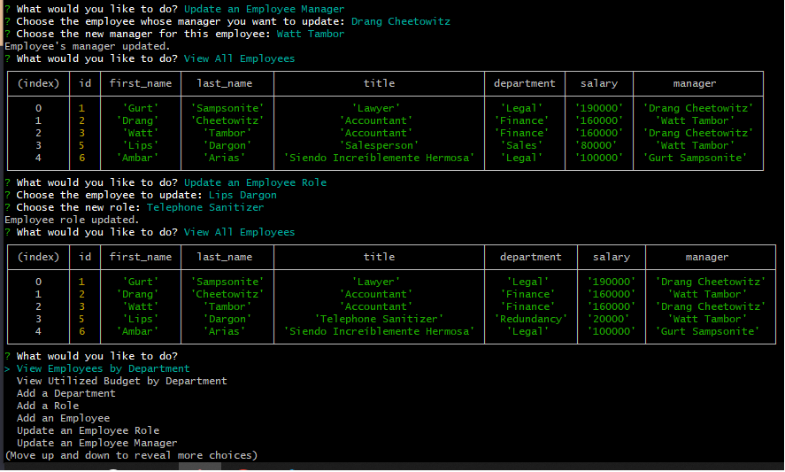

# Employee Tracker

## Description

- **What was your motivation?**  
The goal was to create a robust command-line interface for managing a company's internal structure, including departments, roles, and employees.

- **Why did you build this project?**  
The aim was to provide a fast and efficient way for business owners or HR managers to have an overview and manipulate their organizational structure, without the need for any technical expertise.

- **What problem does it solve?**  
This project eliminates the need for manual tracking and provides a singular point for executing CRUD operations related to employees, roles, and departments.

- **What did you learn?**  
Gained valuable experience in working with Node.js, Inquirer, and MySQL. Learned about creating asynchronous queries, designing CLI interfaces, and the challenges of handling user input and database operations.

## Table of Contents

- [Installation](#installation)
- [Usage](#usage)
- [Credits](#credits)
- [License](#license)
- [Features](#features)
- [How to Contribute](#how-to-contribute)
- [Tests](#tests)

## Installation

1. Clone the GitHub repository
2. Navigate to the project directory and run `npm install` to install dependencies.
3. Run `npm i inquirer@8.2.4` specifically for inquirer.
4. Set up your MySQL database and update the database credentials in the connection setup.

## Usage

To start the application, navigate to the project directory and run `node index.js`. Follow the command-line prompts to manage your company's organizational structure.

## Demo

Watch the demo video here: [Employee Tracker Demo Video](https://share.vidyard.com/watch/fLjpBWXmsBjkxqMLpAeRtx?)

## Credits

- **Collaborators**: None
- **Third-Party Assets**:  
  - [Inquirer](https://www.npmjs.com/package/inquirer)
  - [MySQL2](https://www.npmjs.com/package/mysql2)
- **Tutorials**:  
  - [University of Texas at Austin Coding Bootcamp](https://bootcamp.cvn.utexas.edu/)
  - ChatGPT4 for code refactors

## License

[MIT License](https://choosealicense.com/licenses/mit/)

---

## Features

- View all departments, roles, and employees
- Add new departments, roles, and employees
- Update existing employee roles
- Delete departments, roles, and employees
- View utilized budget by department

## How to Contribute

If you're interested in contributing, please fork the repository and use a feature branch. Pull requests are warmly welcome.
